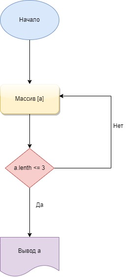

# FinalTask

1.Проходим по эллементам массива при помощи метода filter() и указываем условие, что каждый эллемент массива имеет длину меньше либо равную 3
2.На выходе получаем новый отфильрованный массив с указаными эллементами массива